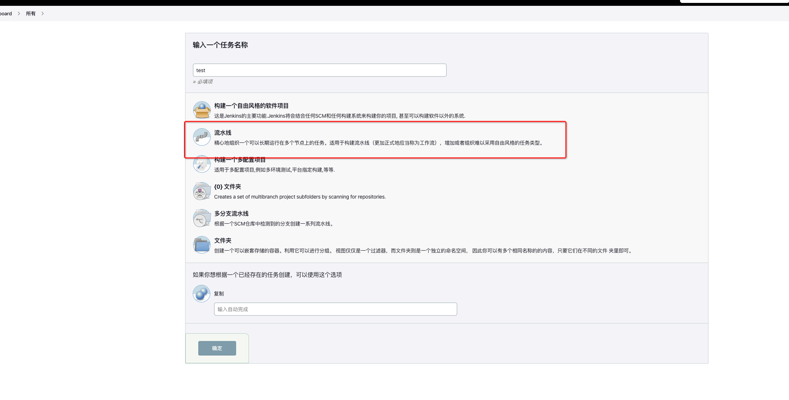
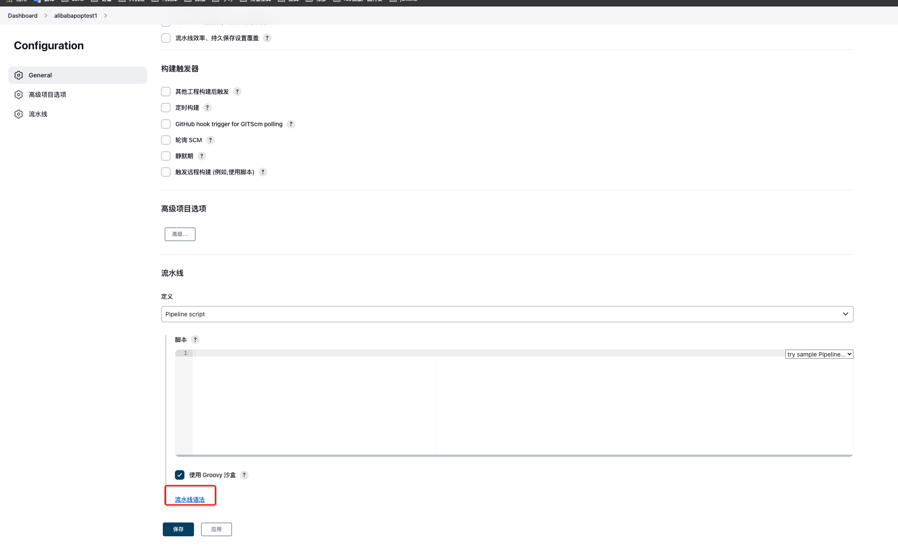
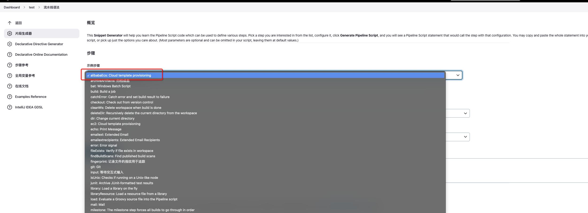
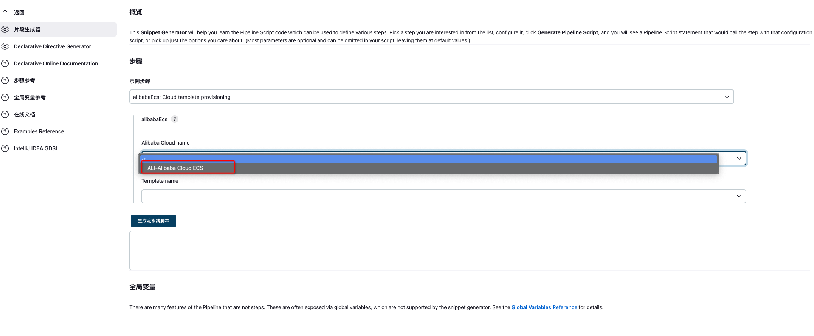
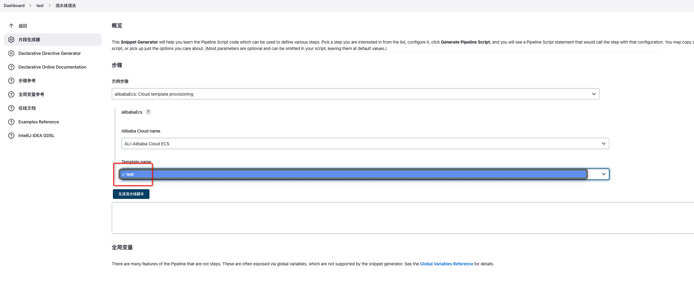
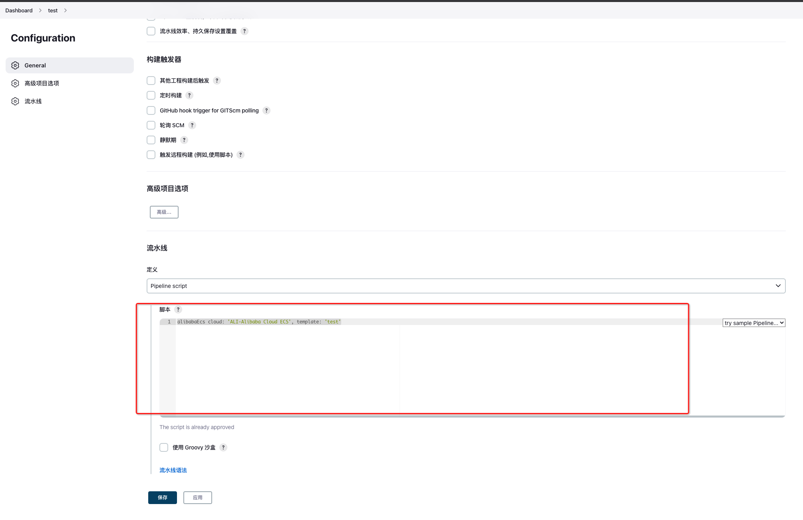

# AlibabaEcs Step pipeline

## 使用步骤
1. 配置ecs 模版配置
   
2. 新建一个流水线任务
   
3. 点击流水线语法
   
4. 示例步骤 选择 alibabaEcs: Cloud template provisioning
   
5. Alibaba Cloud name 选择刚创建模版名词
   
6. Template name 选择刚创建模版配置中的ecs模版描述
   
7. 点击生成流水线脚本
   
8. 复制框中生成的脚本
9. 粘贴脚本到流水线中的脚本文本框内
   
10. 不使用Groovy沙盘
    
    
11. 点击保存
12. 点击立即构建