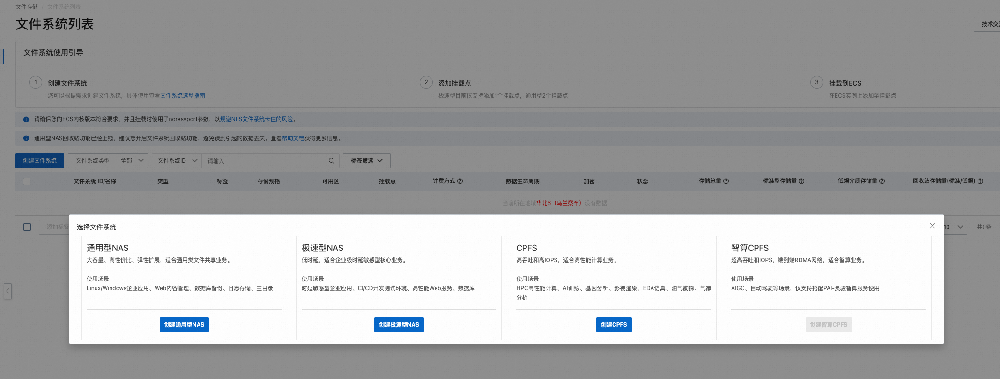
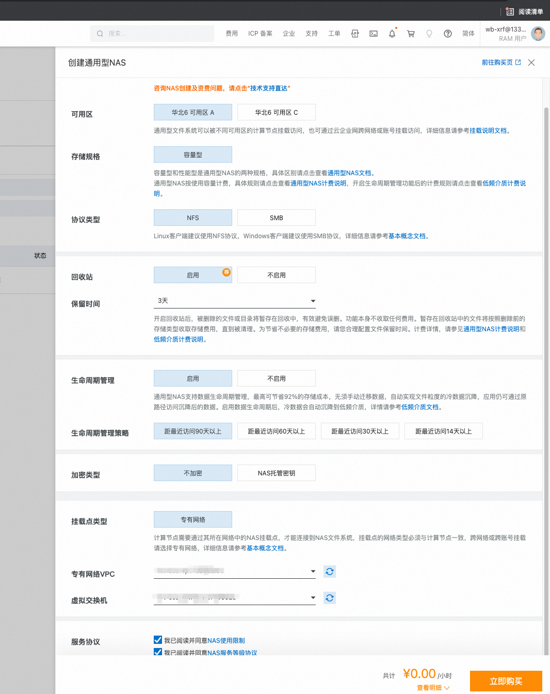
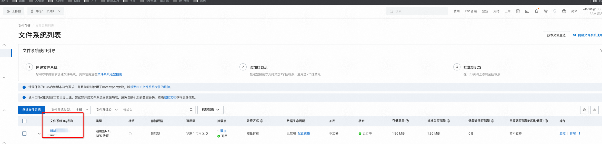
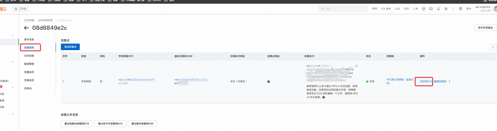
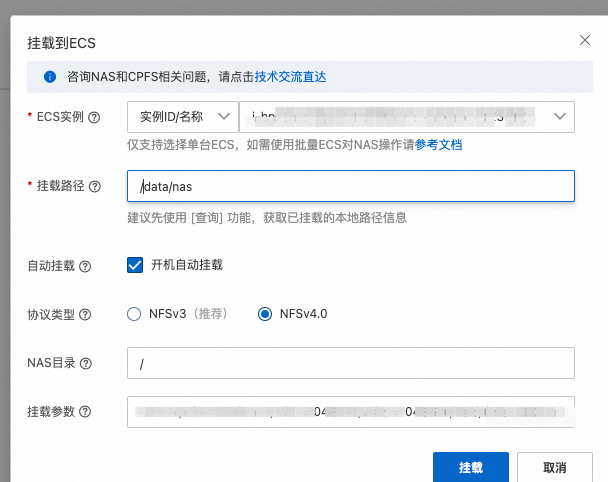
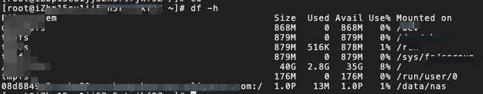
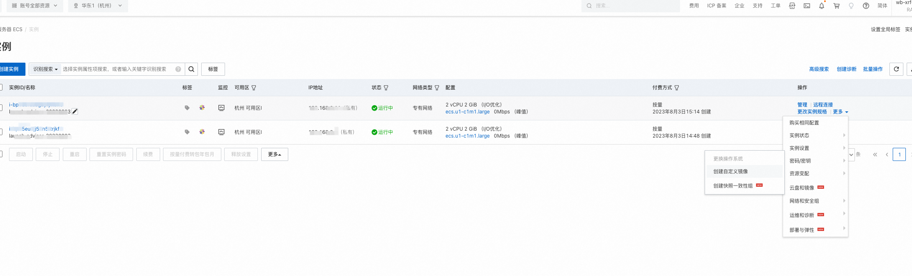

# 加速Java Maven构建

使用挂载  [NAS(文件存储)](https://help.aliyun.com/zh/nas/product-overview/what-is-nas?spm=a2c4g.11186623.0.0.17da61fd36UpTC) 加速
Java Maven构建

## 使用步骤

1. 创建ecs 下载 maven 并配置maven的setting缓存目录为/data/nas/maven/cache
2. 在ecs上创建/data/nas目录
   
3. 在[NAS控制台](https://nasnext.console.aliyun.com/cn-hangzhou/filesystem) 创建文件系统
   
4. 点击创建出的文件系统
   
5. 点击挂载使用，点击添加到ECS
   
6. 点击挂载，选择刚配置maven的ecs
   
7. 填写挂载路径为/data/nas, 默认开机自动挂载，选择协议类型为NFSv4.0（多台ECS同时编辑一个文件，请使用NFSv4.0），点击挂载
   
8. 登录ecs使用 df-h 命令查看nas是否挂载
   
9.
返回[ecs控制台](https://www.aliyun.com/product/ecs?spm=5176.28055625.J_3207526240.33.5861154aEUhMD6&scm=20140722.M_5288647._.V_1)
，点击更多，选择云盘和镜像创建自定义镜像

10.使用jenkins插件创建ecs时镜像填写刚创建的镜像Id

## 注意

1. ECS 关联 VPC 必须跟挂载地址所在 VPC 相同，NAS 存储配置才能生效。
2. 文件系统所在可用区：华东 1 可用区 G。通用型 NAS 可跨可用区挂载，极速型不推荐跨可用区。